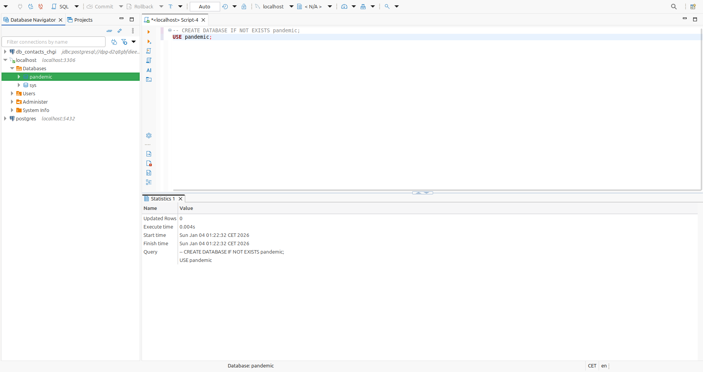
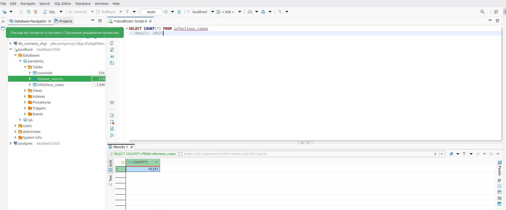
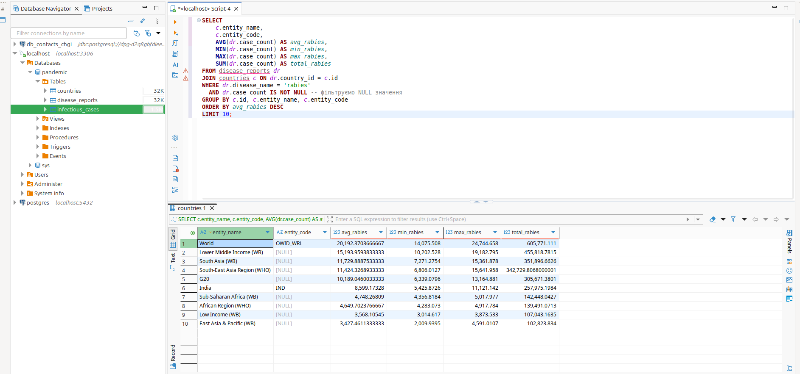
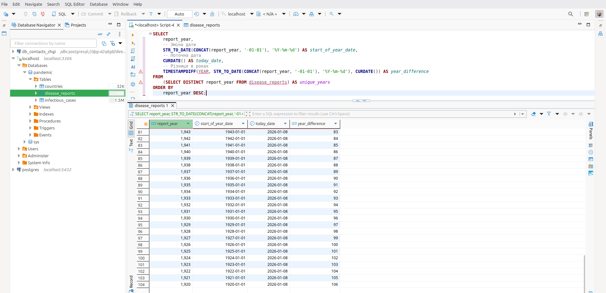

# goit-rdb-fp

Фінальний проєкт:

### Завдання 1:

> Завантажте дані:
>
> - Створіть схему pandemic у базі даних за допомогою SQL-команди.
> - Оберіть її як схему за замовчуванням за допомогою SQL-команди.
> - Імпортуйте дані за допомогою Import wizard так, як ви вже робили це у темі 3.
>   Продивіться дані, щоб бути у контексті.

---

```sql
CREATE DATABASE IF NOT EXISTS pandemic;
```

```sql
USE pandemic;
```

_1_Create_DB.png_


---

### Завдання 2:

> Нормалізуйте таблицю infectious_cases до 3-ї нормальної форми. Збережіть у цій же схемі дві таблиці з нормалізованими даними.

---

- Створення таблиці `countries`
```sql
CREATE TABLE countries (
    id INT AUTO_INCREMENT PRIMARY KEY,
    entity_name VARCHAR(255) NOT NULL,
    entity_code VARCHAR(50) DEFAULT NULL,
    UNIQUE KEY (entity_name)
);
```
- Створення таблиці `disease_reports`
```sql
CREATE TABLE disease_reports (
    id INT AUTO_INCREMENT PRIMARY KEY,
    country_id INT NOT NULL,
    report_year INT NOT NULL,
    disease_name VARCHAR(100) NOT NULL,
    case_count DOUBLE DEFAULT NULL,
    FOREIGN KEY (country_id) REFERENCES countries(id)
);
```
- Заповнення таблиці `countries`
```sql
INSERT INTO countries (entity_name, entity_code)
SELECT DISTINCT Entity, NULLIF(Code, '') 
FROM infectious_cases;
```
- Заповнення таблиці `disease_reports`
```sql
INSERT INTO disease_reports (country_id, report_year, disease_name, case_count)
SELECT 
    c.id, 
    ic.Year, 
    'yaws', 
    NULLIF(ic.Number_yaws, '') -- Конвертація порожніх рядків у NULL
FROM infectious_cases ic
JOIN countries c ON ic.Entity = c.entity_name
WHERE ic.Number_yaws != '' OR ic.Number_yaws IS NOT NULL

UNION ALL

SELECT c.id, ic.Year, 'polio', ic.polio_cases 
FROM infectious_cases ic
JOIN countries c ON ic.Entity = c.entity_name
WHERE ic.polio_cases IS NOT NULL

UNION ALL

SELECT c.id, ic.Year, 'guinea_worm', ic.cases_guinea_worm 
FROM infectious_cases ic
JOIN countries c ON ic.Entity = c.entity_name
WHERE ic.cases_guinea_worm IS NOT NULL

UNION ALL

SELECT c.id, ic.Year, 'rabies', ic.Number_rabies 
FROM infectious_cases ic
JOIN countries c ON ic.Entity = c.entity_name
WHERE ic.Number_rabies IS NOT NULL

UNION ALL

SELECT c.id, ic.Year, 'malaria', ic.Number_malaria 
FROM infectious_cases ic
JOIN countries c ON ic.Entity = c.entity_name
WHERE ic.Number_malaria IS NOT NULL

UNION ALL

SELECT c.id, ic.Year, 'hiv', ic.Number_hiv 
FROM infectious_cases ic
JOIN countries c ON ic.Entity = c.entity_name
WHERE ic.Number_hiv IS NOT NULL

UNION ALL

SELECT c.id, ic.Year, 'tuberculosis', ic.Number_tuberculosis 
FROM infectious_cases ic
JOIN countries c ON ic.Entity = c.entity_name
WHERE ic.Number_tuberculosis IS NOT NULL

UNION ALL

SELECT c.id, ic.Year, 'smallpox', NULLIF(ic.Number_smallpox, '') 
FROM infectious_cases ic
JOIN countries c ON ic.Entity = c.entity_name
WHERE ic.Number_smallpox != '' OR ic.Number_smallpox IS NOT NULL

UNION ALL

SELECT c.id, ic.Year, 'cholera', ic.Number_cholera_cases 
FROM infectious_cases ic
JOIN countries c ON ic.Entity = c.entity_name
WHERE ic.Number_cholera_cases IS NOT NULL;
```

```sql
SELECT COUNT(*) FROM infectious_cases
-- Result: 10521
```

_2_3N.png_


---

### Завдання 3:

> Проаналізуйте дані:
>
> - Для кожної унікальної комбінації Entity та Code або їх id порахуйте середнє, мінімальне, максимальне значення та суму для атрибута Number_rabies.
> - Результат відсортуйте за порахованим середнім значенням у порядку спадання.
> - Оберіть тільки 10 рядків для виведення на екран.

---

```sql
SELECT 
    c.entity_name, 
    c.entity_code,
    AVG(dr.case_count) AS avg_rabies,
    MIN(dr.case_count) AS min_rabies,
    MAX(dr.case_count) AS max_rabies,
    SUM(dr.case_count) AS total_rabies
FROM disease_reports dr
JOIN countries c ON dr.country_id = c.id
WHERE dr.disease_name = 'rabies' 
  AND dr.case_count IS NOT NULL -- фільтруємо NULL значення
GROUP BY c.id, c.entity_name, c.entity_code
ORDER BY avg_rabies DESC
LIMIT 10;
```

_3_Number_rabies.png_


---

### Завдання 4:

> Побудуйте колонку різниці в роках.\
> Для оригінальної або нормованої таблиці для колонки Year побудуйте з використанням вбудованих SQL-функцій:
>
> - атрибут, що створює дату першого січня відповідного року,
> - атрибут, що дорівнює поточній даті,
> - атрибут, що дорівнює різниці в роках двох вищезгаданих колонок.

---

```sql
SELECT 
    report_year,
    -- Зміна дати
    STR_TO_DATE(CONCAT(report_year, '-01-01'), '%Y-%m-%d') AS start_of_year_date,
    -- Поточна дата
    CURDATE() AS today_date,
    -- Різниця в роках
    TIMESTAMPDIFF(YEAR, STR_TO_DATE(CONCAT(report_year, '-01-01'), '%Y-%m-%d'), CURDATE()) AS year_difference
FROM 
    (SELECT DISTINCT report_year FROM disease_reports) AS unique_years
ORDER BY 
    report_year DESC;
```

_4_Year.png_


---

### Завдання 5:

> Побудуйте власну функцію.\
> Створіть і використайте функцію, що будує такий же атрибут, як і в попередньому завданні: функція має приймати на вхід значення року, а повертати різницю в роках між поточною датою та датою, створеною з атрибута року (1996 рік → '1996-01-01').

---

```sql

```

_p1_date.png_


---
