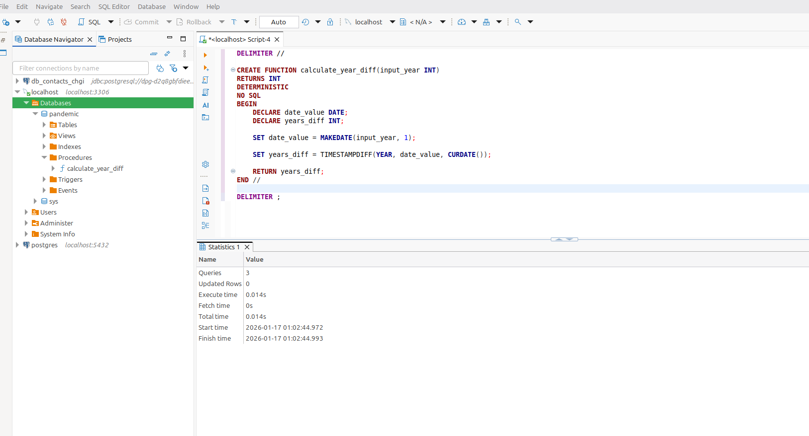

# goit-rdb-fp

Фінальний проєкт:

### Завдання 1:

> Завантажте дані:
>
> - Створіть схему pandemic у базі даних за допомогою SQL-команди.
> - Оберіть її як схему за замовчуванням за допомогою SQL-команди.
> - Імпортуйте дані за допомогою Import wizard так, як ви вже робили це у темі 3.
>   Продивіться дані, щоб бути у контексті.

---

```sql
CREATE DATABASE IF NOT EXISTS pandemic;
```

```sql
USE pandemic;
```

DDL
```sql
CREATE TABLE `infectious_cases` (
  `Entity` varchar(50) DEFAULT NULL,
  `Code` varchar(50) DEFAULT NULL,
  `Year` int DEFAULT NULL,
  `Number_yaws` double DEFAULT NULL,
  `polio_cases` double DEFAULT NULL,
  `cases_guinea_worm` double DEFAULT NULL,
  `Number_rabies` double DEFAULT NULL,
  `Number_malaria` double DEFAULT NULL,
  `Number_hiv` double DEFAULT NULL,
  `Number_tuberculosis` double DEFAULT NULL,
  `Number_smallpox` double DEFAULT NULL,
  `Number_cholera_cases` double DEFAULT NULL
) ENGINE=InnoDB DEFAULT CHARSET=utf8mb4 COLLATE=utf8mb4_0900_ai_ci;
```

_1_Create_DB.png_


---

### Завдання 2:

> Нормалізуйте таблицю infectious_cases до 3-ї нормальної форми. Збережіть у цій же схемі дві таблиці з нормалізованими даними.

---

- Створення таблиці `countries`
```sql
CREATE TABLE countries (
    id INT AUTO_INCREMENT PRIMARY KEY,
    entity_name VARCHAR(255) NOT NULL,
    entity_code VARCHAR(50) DEFAULT NULL,
    UNIQUE KEY (entity_name)
);
```
- Створення таблиці `disease_reports`
```sql
CREATE TABLE disease_reports (
    id INT AUTO_INCREMENT PRIMARY KEY,
    country_id INT NOT NULL,
    report_year INT NOT NULL,
    disease_name VARCHAR(100) NOT NULL,
    case_count DOUBLE DEFAULT NULL,
    FOREIGN KEY (country_id) REFERENCES countries(id)
);
```
- Заповнення таблиці `countries`
```sql
INSERT INTO countries (entity_name, entity_code)
SELECT DISTINCT Entity, Code 
FROM infectious_cases;
```
- Заповнення таблиці `disease_reports`
```sql
INSERT INTO disease_reports (country_id, report_year, disease_name, case_count)
SELECT c.id, ic.Year, 'yaws', ic.Number_yaws FROM infectious_cases ic JOIN countries c ON ic.Entity = c.entity_name WHERE ic.Number_yaws IS NOT NULL
UNION ALL
SELECT c.id, ic.Year, 'polio', ic.polio_cases FROM infectious_cases ic JOIN countries c ON ic.Entity = c.entity_name WHERE ic.polio_cases IS NOT NULL
UNION ALL
SELECT c.id, ic.Year, 'guinea_worm', ic.cases_guinea_worm FROM infectious_cases ic JOIN countries c ON ic.Entity = c.entity_name WHERE ic.cases_guinea_worm IS NOT NULL
UNION ALL
SELECT c.id, ic.Year, 'rabies', ic.Number_rabies FROM infectious_cases ic JOIN countries c ON ic.Entity = c.entity_name WHERE ic.Number_rabies IS NOT NULL
UNION ALL
SELECT c.id, ic.Year, 'malaria', ic.Number_malaria FROM infectious_cases ic JOIN countries c ON ic.Entity = c.entity_name WHERE ic.Number_malaria IS NOT NULL
UNION ALL
SELECT c.id, ic.Year, 'hiv', ic.Number_hiv FROM infectious_cases ic JOIN countries c ON ic.Entity = c.entity_name WHERE ic.Number_hiv IS NOT NULL
UNION ALL
SELECT c.id, ic.Year, 'tuberculosis', ic.Number_tuberculosis FROM infectious_cases ic JOIN countries c ON ic.Entity = c.entity_name WHERE ic.Number_tuberculosis IS NOT NULL
UNION ALL
SELECT c.id, ic.Year, 'smallpox', ic.Number_smallpox FROM infectious_cases ic JOIN countries c ON ic.Entity = c.entity_name WHERE ic.Number_smallpox IS NOT NULL
UNION ALL
SELECT c.id, ic.Year, 'cholera', ic.Number_cholera_cases FROM infectious_cases ic JOIN countries c ON ic.Entity = c.entity_name WHERE ic.Number_cholera_cases IS NOT NULL;
```

```sql
SELECT COUNT(*) FROM infectious_cases;
-- Result: 10521
```

_2_3N.png_


---

### Завдання 3:

> Проаналізуйте дані:
>
> - Для кожної унікальної комбінації Entity та Code або їх id порахуйте середнє, мінімальне, максимальне значення та суму для атрибута Number_rabies.
> - Результат відсортуйте за порахованим середнім значенням у порядку спадання.
> - Оберіть тільки 10 рядків для виведення на екран.

---

```sql
SELECT 
    Entity,
    Code,
    AVG(Number_rabies) AS average_rabies,
    MIN(Number_rabies) AS min_rabies,
    MAX(Number_rabies) AS max_rabies,
    SUM(Number_rabies) AS sum_rabies
FROM 
    pandemic.infectious_cases
WHERE 
    Number_rabies IS NOT NULL 
GROUP BY 
    Entity, Code
ORDER BY 
    average_rabies DESC
LIMIT 10;
```

_3_Number_rabies.png_


---

### Завдання 4:

> Побудуйте колонку різниці в роках.\
> Для оригінальної або нормованої таблиці для колонки Year побудуйте з використанням вбудованих SQL-функцій:
>
> - атрибут, що створює дату першого січня відповідного року,
> - атрибут, що дорівнює поточній даті,
> - атрибут, що дорівнює різниці в роках двох вищезгаданих колонок.

---

```sql
SELECT 
    Year,
    MAKEDATE(Year, 1) AS start_of_year_date,
    CURDATE() AS today_date,
    TIMESTAMPDIFF(YEAR, MAKEDATE(Year, 1), CURDATE()) AS year_difference
FROM 
    pandemic.infectious_cases;
```

_4_Year.png_


---

### Завдання 5:

> Побудуйте власну функцію.\
> Створіть і використайте функцію, що будує такий же атрибут, як і в попередньому завданні: функція має приймати на вхід значення року, а повертати різницю в роках між поточною датою та датою, створеною з атрибута року (1996 рік → '1996-01-01').

---

- Функція
```sql
DELIMITER //

CREATE FUNCTION calculate_year_diff(input_year INT)
RETURNS INT
DETERMINISTIC 
NO SQL
BEGIN
    DECLARE date_value DATE;
    DECLARE years_diff INT;
    
    SET date_value = MAKEDATE(input_year, 1);
    
    SET years_diff = TIMESTAMPDIFF(YEAR, date_value, CURDATE());
    
    RETURN years_diff;
END //

DELIMITER ;
```

- Виконання
```sql
SELECT 
    Year,
    calculate_year_diff(Year) AS year_difference
FROM 
    pandemic.infectious_cases;
```

_5_Function.png_


_5_1_Function.png_


---
